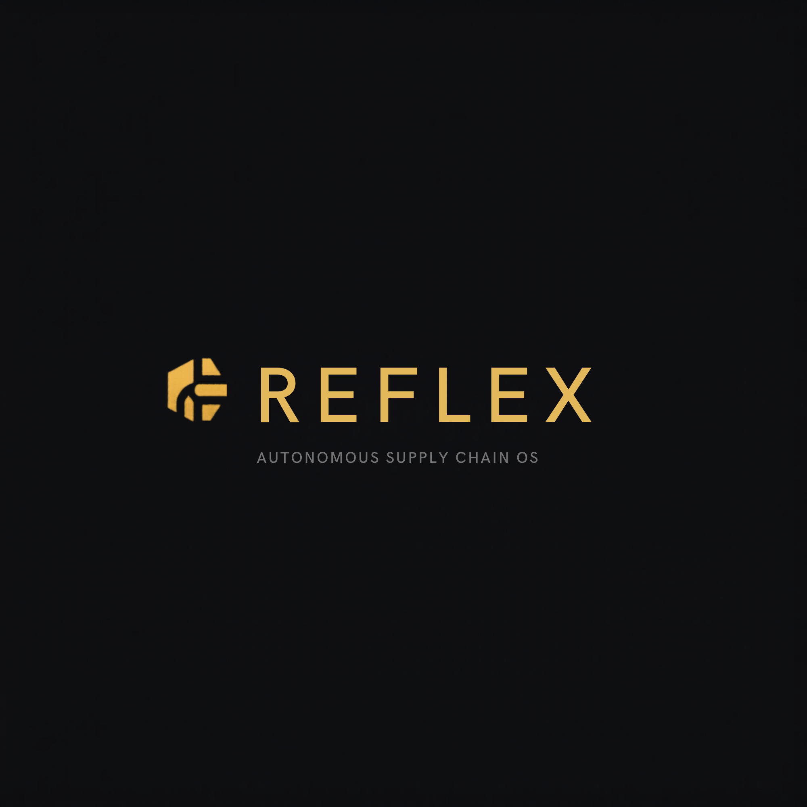

# R3FLEX

<p align="center">
  
</p>

<p align="center">
  <strong>Every signal. Every border.</strong><br />
  Agentic supply-chain intelligence that detects disruption, simulates options, and drives execution.
</p>

## What R3FLEX Is

R3FLEX is an execution-first logistics intelligence platform. It combines live event ingestion, digital-twin simulation, and decision workflows so teams can react to disruption with speed and traceability.

Core platform goals:
- Detect risk in real time across routes, ports, and suppliers.
- Simulate scenario options before impact cascades.
- Route decisions through confidence-aware automation and approvals.
- Preserve an auditable trail of why each action was recommended or taken.

## Product Highlights

- Global event awareness across multi-region operations.
- Live operational visualization and route-level context.
- Human-in-the-loop control path for lower-confidence decisions.
- Dashboard experience designed for rapid triage and action.
- Supabase-ready authentication and data wiring.

## Architecture Overview

R3FLEX uses a web frontend with optional backend services:

- Frontend: Next.js App Router in [frontend/app](frontend/app).
- Shared UI: reusable components in [frontend/components](frontend/components).
- Hooks and shared logic: [frontend/hooks](frontend/hooks), [frontend/lib](frontend/lib).
- Optional backend stack: FastAPI + Postgres + Redis in [r3flex-backend](r3flex-backend).
- Optional Supabase schema and migrations: [supabase](supabase).

High-level runtime topology:

```text
Browser
  -> Next.js frontend (:3000)
      -> REST and WebSocket integration points
          -> FastAPI backend (:8000, optional local stack)
              -> Postgres + Redis
```

## Repository Layout

```text
R3FLEX/
|- frontend/            # Next.js app, configs, assets, and frontend env
|  |- app/              # Next.js pages, layouts, route groups
|  |- components/       # Landing, dashboard, and reusable UI components
|  |- hooks/            # Custom client hooks
|  |- lib/              # Shared utilities and API helpers
|  `- public/           # Static assets
|- r3flex-backend/      # FastAPI backend and tests
|- supabase/            # SQL schema and migrations
`- SETUP.md             # End-to-end local environment setup
```

## Quick Start (Frontend)

Requirements:
- Node.js 18+

Install and run:

```bash
cd frontend
pnpm install
pnpm dev
```

Then open `http://localhost:3000`.

If you prefer npm:

```bash
cd frontend
npm install
npm run dev
```

## Full Local Stack (Frontend + Backend)

For full local setup including Docker services, migrations, backend API, and demo flow, follow:

- [SETUP.md](SETUP.md)

## Environment Variables

Frontend variables are documented in [frontend/.env.example](frontend/.env.example):

- `NEXT_PUBLIC_SUPABASE_URL`
- `NEXT_PUBLIC_SUPABASE_ANON_KEY`
- `NEXT_PUBLIC_WS_URL` (optional override)

Create your local env file before running production-like flows:

```bash
cd frontend
cp .env.example .env
```

## Frontend Scripts

From [frontend/package.json](frontend/package.json):

- `pnpm dev` - run development server
- `pnpm build` - production build
- `pnpm start` - run production server
- `pnpm lint` - lint workspace

## Development Notes

- Landing page and core brand narrative are in [frontend/app/page.tsx](frontend/app/page.tsx).
- Global theme tokens and base styles are in [frontend/app/globals.css](frontend/app/globals.css).
- Root layout and metadata are in [frontend/app/layout.tsx](frontend/app/layout.tsx).

## License

MIT
