# R3FLEX

<p align="center">
  
</p>

<p align="center">
  <strong>Every signal. Every border.</strong><br />
  Agentic supply-chain intelligence that detects disruption, simulates options, and drives execution.
</p>

---

## What is R3FLEX?

Think of R3FLEX as a **smart assistant for global shipping**. When something bad happens in the world — a storm in the Suez Canal, a fire in a factory, a strike at a port — R3FLEX notices, thinks about what to do, and either fixes the problem itself or asks a human for permission.

It has three main parts:
- **Frontend** — the website you see in your browser
- **Backend** — the "brain" running on a server that does the thinking
- **Database (Supabase)** — the "filing cabinet" where everything is stored

Let's look at how each part works, step by step.

> **About the diagrams:** every diagram below is a [Mermaid](https://mermaid.js.org/) block, so they render natively on GitHub. Each one is paired with a short "how to read it" note.

---

## 1. The Big Picture (How Everything Talks to Each Other)

Imagine you order something online. There is a **website** (frontend) where you click "track my order". The website sends a message to a **server** (backend) that does the hard work. The server checks a **database** for your order info, then sends the answer back to the website to show you. R3FLEX works the same way, but for global supply chains.

### 1.1 System-Level Architecture
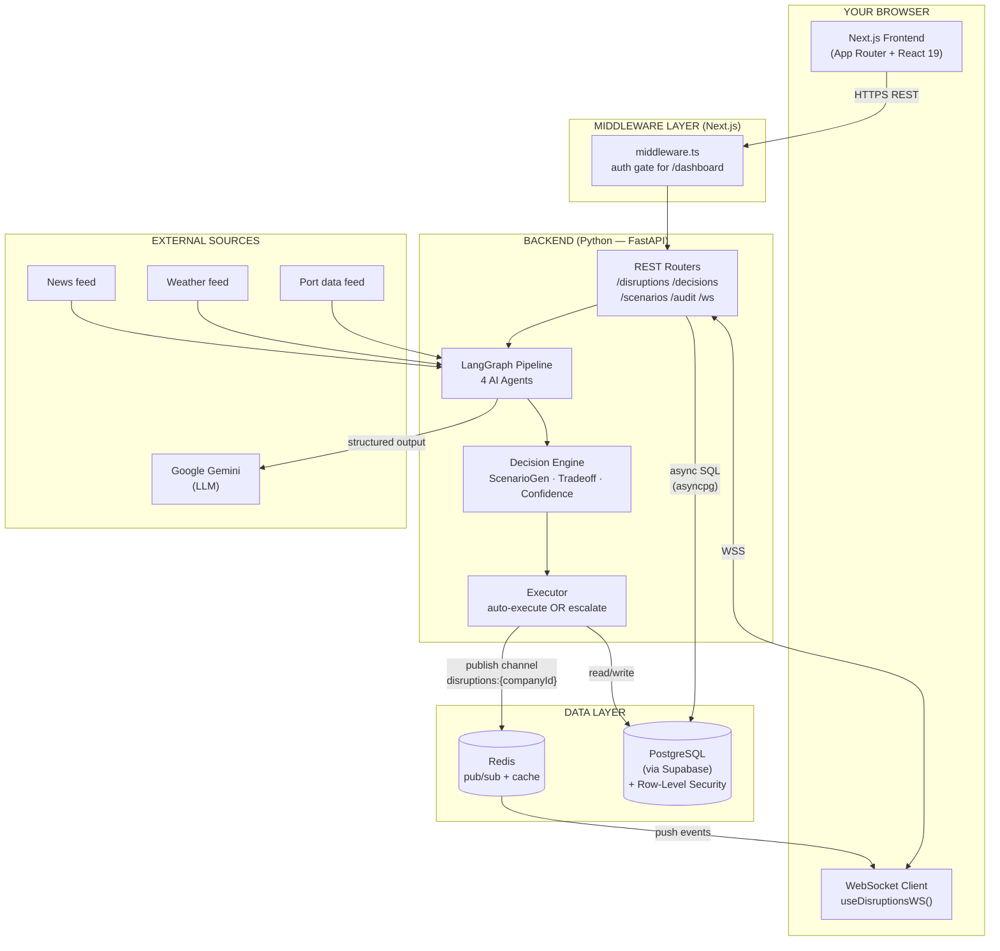
```mermaid
graph TB
    subgraph Browser["YOUR BROWSER"]
        UI["Next.js Frontend<br/>(App Router + React 19)"]
        WS["WebSocket Client<br/>useDisruptionsWS()"]
    end

    subgraph Edge["MIDDLEWARE LAYER (Next.js)"]
        MW["middleware.ts<br/>auth gate for /dashboard"]
    end

    subgraph Server["BACKEND (Python — FastAPI)"]
        API["REST Routers<br/>/disruptions /decisions<br/>/scenarios /audit /ws"]
        AGENTS["LangGraph Pipeline<br/>4 AI Agents"]
        ENGINE["Decision Engine<br/>ScenarioGen · Tradeoff · Confidence"]
        EXEC["Executor<br/>auto-execute OR escalate"]
    end

    subgraph Data["DATA LAYER"]
        PG[("PostgreSQL<br/>(via Supabase)<br/>+ Row-Level Security")]
        RD[("Redis<br/>pub/sub + cache")]
    end

    subgraph External["EXTERNAL SOURCES"]
        NEWS["News feed"]
        WEATHER["Weather feed"]
        PORT["Port data feed"]
        GEM["Google Gemini<br/>(LLM)"]
    end

    UI -- "HTTPS REST" --> MW --> API
    WS <-- "WSS" --> API
    API --> AGENTS
    AGENTS -- "structured output" --> GEM
    AGENTS --> ENGINE
    ENGINE --> EXEC
    EXEC -- "publish channel<br/>disruptions:{companyId}" --> RD
    EXEC -- "read/write" --> PG
    API -- "async SQL<br/>(asyncpg)" --> PG
    RD -- "push events" --> WS
    NEWS & WEATHER & PORT --> AGENTS
```

**How to read it:** the three big bubbles are *who* (browser, server, data). Arrows show *direction* of data flow. The LLM is an external service the backend calls; Redis is the messenger between the executor and the browser.

### 1.2 Data-Flow Sequence (one full request)

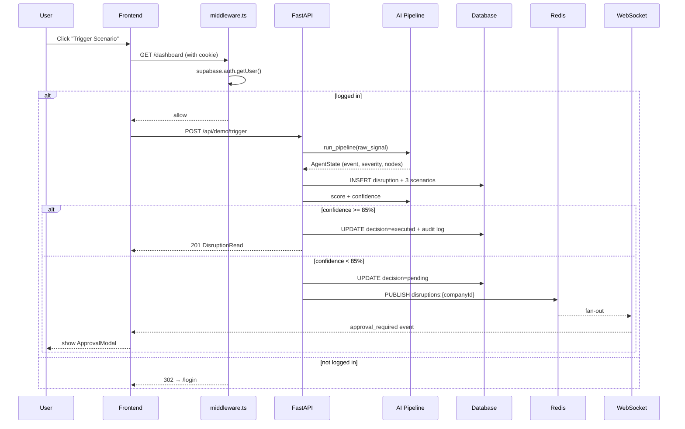
```mermaid
sequenceDiagram
    participant U as User
    participant F as Frontend
    participant M as middleware.ts
    participant B as FastAPI
    participant A as AI Pipeline
    participant D as Database
    participant R as Redis
    participant W as WebSocket

    U->>F: Click "Trigger Scenario"
    F->>M: GET /dashboard (with cookie)
    M->>M: supabase.auth.getUser()
    alt logged in
        M-->>F: allow
        F->>B: POST /api/demo/trigger
        B->>A: run_pipeline(raw_signal)
        A-->>B: AgentState (event, severity, nodes)
        B->>D: INSERT disruption + 3 scenarios
        B->>A: score + confidence
        alt confidence >= 85%
            B->>D: UPDATE decision=executed + audit log
            B-->>F: 201 DisruptionRead
        else confidence < 85%
            B->>D: UPDATE decision=pending
            B->>R: PUBLISH disruptions:{companyId}
            R-->>W: fan-out
            W-->>F: approval_required event
            F-->>U: show ApprovalModal
        end
    else not logged in
        M-->>F: 302 → /login
    end
```


### 1.3 High-Level Folder Map
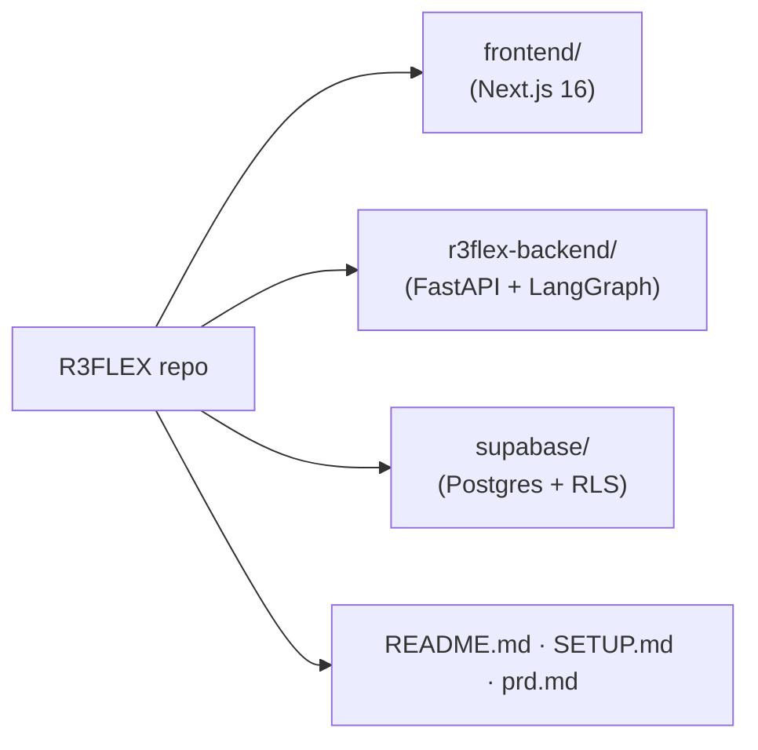
```mermaid
graph LR
    R["R3FLEX repo"] --> FE["frontend/<br/>(Next.js 16)"]
    R --> BE["r3flex-backend/<br/>(FastAPI + LangGraph)"]
    R --> SB["supabase/<br/>(Postgres + RLS)"]
    R --> DOCS["README.md · SETUP.md · prd.md"]
```

---

## 2. Frontend Workflow (What Happens in Your Browser)

The frontend is built with **Next.js 16** — a tool that lets us write the website in the React framework but with extra powers (file-based routing, server components, etc.).

### 2.1 The Page Tree (Mermaid)

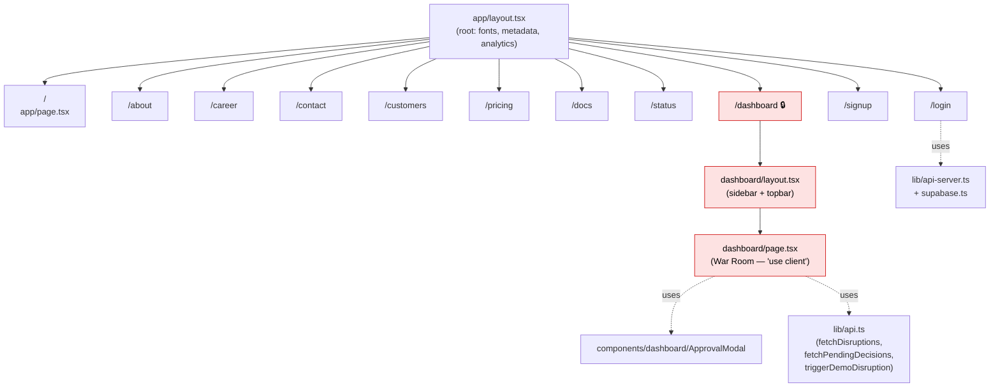
```mermaid
graph TB
    Root["app/layout.tsx<br/>(root: fonts, metadata, analytics)"]
    Root --> Landing["/<br/>app/page.tsx"]
    Root --> About["/about"]
    Root --> Career["/career"]
    Root --> Contact["/contact"]
    Root --> Customers["/customers"]
    Root --> Pricing["/pricing"]
    Root --> Docs["/docs"]
    Root --> Status["/status"]
    Root --> Login["/login"]
    Root --> Signup["/signup"]
    Root --> Dash["/dashboard  🔒"]

    Dash --> DashLayout["dashboard/layout.tsx<br/>(sidebar + topbar)"]
    DashLayout --> DashPage["dashboard/page.tsx<br/>(War Room — 'use client')"]
    DashPage -. uses .-> Modal["components/dashboard/ApprovalModal"]
    DashPage -. uses .-> APILib["lib/api.ts<br/>(fetchDisruptions,<br/>fetchPendingDecisions,<br/>triggerDemoDisruption)"]

    Login -. uses .-> AuthLib["lib/api-server.ts<br/>+ supabase.ts"]

    classDef lock fill:#fde2e2,stroke:#c00,color:#000
    class Dash,DashLayout,DashPage lock
```

🔒 = protected by `middleware.ts`.

### 2.2 Login & Access Flow

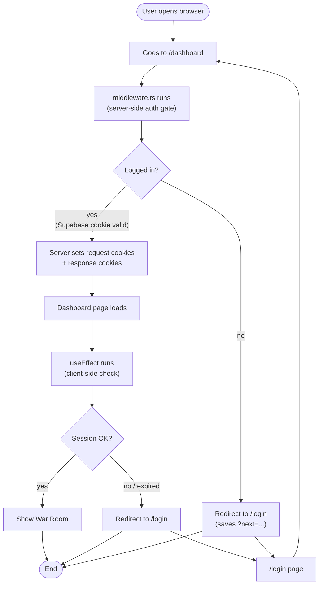
```mermaid
flowchart TB
    Start(["User opens browser"]) --> Visit
    Visit["Goes to /dashboard"] --> MW
    MW["middleware.ts runs<br/>(server-side auth gate)"] --> Decision{Logged in?}
    Decision -- "yes<br/>(Supabase cookie valid)" --> Cookie["Server sets request cookies<br/>+ response cookies"]
    Cookie --> PageLoad["Dashboard page loads"]
    PageLoad --> Effect["useEffect runs<br/>(client-side check)"]
    Effect --> EffectDecision{Session OK?}
    EffectDecision -- "yes" --> Show["Show War Room"]
    EffectDecision -- "no / expired" --> Redirect1["Redirect to /login"]
    Decision -- "no" --> Redirect2["Redirect to /login<br/>(saves ?next=...)"]
    Redirect1 --> Login["/login page"]
    Redirect2 --> Login
    Login --> Visit
    Show --> Stop(["End"])
    Redirect1 --> Stop
    Redirect2 --> Stop
```

**Why two checks?** The middleware stops a logged-out user *before* the page HTML is even sent. The `useEffect` is a backup in case the session expires *while* the user is on the page.

### 2.3 User Journey — Triggering a Scenario (Mermaid Journey)

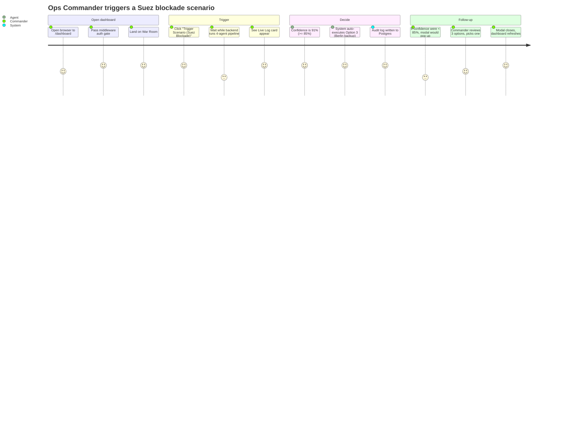
```mermaid
journey
    title Ops Commander triggers a Suez blockade scenario
    section Open dashboard
      Open browser to /dashboard: 4: Commander
      Pass middleware auth gate: 5: Commander
      Land on War Room: 5: Commander
    section Trigger
      Click "Trigger Scenario (Suez Blockade)": 5: Commander
      Wait while backend runs 4-agent pipeline: 3: Commander
      See Live Log card appear: 5: Commander
    section Decide
      Confidence is 91% (>= 85%): 5: Agent
      System auto-executes Option 3 (Berlin backup): 5: Agent
      Audit log written to Postgres: 5: System
    section Follow-up
      If confidence were < 85%, modal would pop up: 3: Commander
      Commander reviews 3 options, picks one: 4: Commander
      Modal closes, dashboard refreshes: 5: Commander
```

### 2.4 Dashboard Workflow

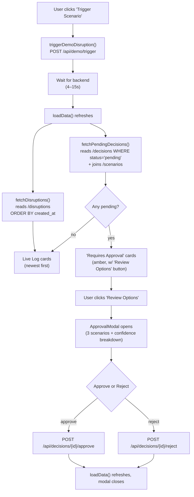
```mermaid
flowchart TB
    Click["User clicks 'Trigger Scenario'"] --> Call
    Call["triggerDemoDisruption()<br/>POST /api/demo/trigger"] --> Wait["Wait for backend<br/>(4–15s)"]
    Wait --> Refresh["loadData() refreshes"]
    Refresh --> F1["fetchDisruptions()<br/>reads /disruptions<br/>ORDER BY created_at"]
    Refresh --> F2["fetchPendingDecisions()<br/>reads /decisions WHERE status='pending'<br/>+ joins /scenarios"]
    F1 --> Log["Live Log cards<br/>(newest first)"]
    F2 --> Approve{"Any pending?"}
    Approve -- "yes" --> Cards["'Requires Approval' cards<br/>(amber, w/ 'Review Options' button)"]
    Approve -- "no" --> Log
    Cards --> Open["User clicks 'Review Options'"]
    Open --> Modal["ApprovalModal opens<br/>(3 scenarios + confidence breakdown)"]
    Modal --> Action{Approve or Reject}
    Action -- "approve" --> A1["POST /api/decisions/{id}/approve"]
    Action -- "reject" --> A2["POST /api/decisions/{id}/reject"]
    A1 --> Reload["loadData() refreshes, modal closes"]
    A2 --> Reload
```

### 2.5 WebSocket Workflow (real-time push)

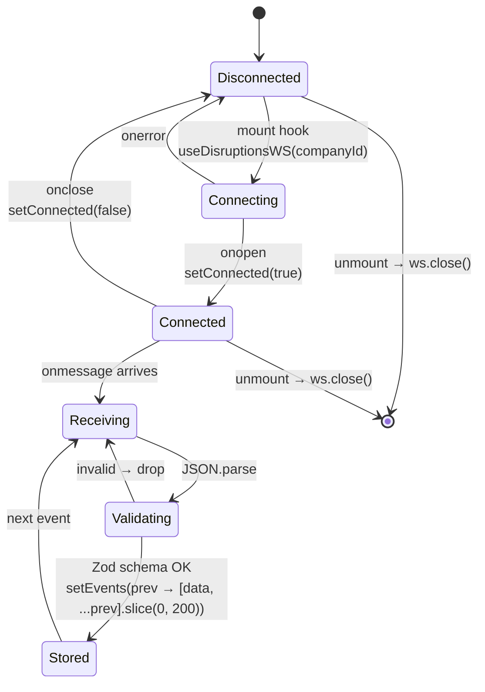
```mermaid
stateDiagram-v2
    [*] --> Disconnected
    Disconnected --> Connecting: mount hook<br/>useDisruptionsWS(companyId)
    Connecting --> Connected: onopen<br/>setConnected(true)
    Connecting --> Disconnected: onerror
    Connected --> Receiving: onmessage arrives
    Receiving --> Validating: JSON.parse
    Validating --> Receiving: invalid → drop
    Validating --> Stored: Zod schema OK<br/>setEvents(prev → [data, ...prev].slice(0, 200))
    Stored --> Receiving: next event
    Connected --> Disconnected: onclose<br/>setConnected(false)
    Disconnected --> [*]: unmount → ws.close()
    Connected --> [*]: unmount → ws.close()
```

**Defense in depth:** every incoming message is checked against a Zod schema. Garbage in = silently dropped. Raw payloads are never logged in production.

### 2.6 Frontend File Map

```text
frontend/
├── app/                    ← All pages (App Router)
│   ├── page.tsx            ← Landing — scroll-globe, marquee, activity ticker
│   ├── layout.tsx          ← Root HTML, fonts, Vercel analytics
│   ├── dashboard/
│   │   ├── layout.tsx      ← Sidebar + topbar (server component)
│   │   └── page.tsx        ← 'use client' — war room, state, fetches
│   ├── login/, signup/     ← Auth views
│   ├── about/, career/,    ← Marketing pages
│   ├── contact/, customers/, pricing/, docs/, status/
│   └── api/                ← Next.js server routes (mutations only)
│
├── components/
│   ├── landing/            ← ScrollGlobe, ActivityTicker, DualMarquee, SiteHeader, SiteFooter
│   ├── dashboard/          ← ApprovalModal, Map, EventStream cards
│   ├── docs/               ← ExecutionFlow, WireframeGlobe, etc.
│   └── ui/                 ← shadcn-style primitives (button, card, dialog, …)
│
├── hooks/
│   ├── use-disruptions-ws.ts   ← WebSocket client w/ Zod validation
│   ├── use-toast.ts            ← Toast queue
│   └── use-mobile.ts           ← Responsive breakpoint helper
│
├── lib/
│   ├── api.ts              ← Browser-side reads (anon key) + POST helpers
│   ├── api-server.ts       ← Server-side helpers (service-role key)
│   ├── supabase.ts         ← Browser Supabase client factory
│   ├── errors.ts           ← sanitizeError() — never leak PostgREST errors
│   ├── auth-field-classes.ts
│   └── utils.ts            ← cn() — className composer
│
├── middleware.ts           ← /dashboard auth gate
├── next.config.mjs         ← CSP, security headers, image config
└── package.json
```

---

## 3. Backend Architecture (the Python Brain)

The backend is built with **FastAPI** (a fast web framework for Python) and runs an **AI agent pipeline** to detect, analyze, and respond to supply-chain disruptions.

### 3.1 Startup Sequence

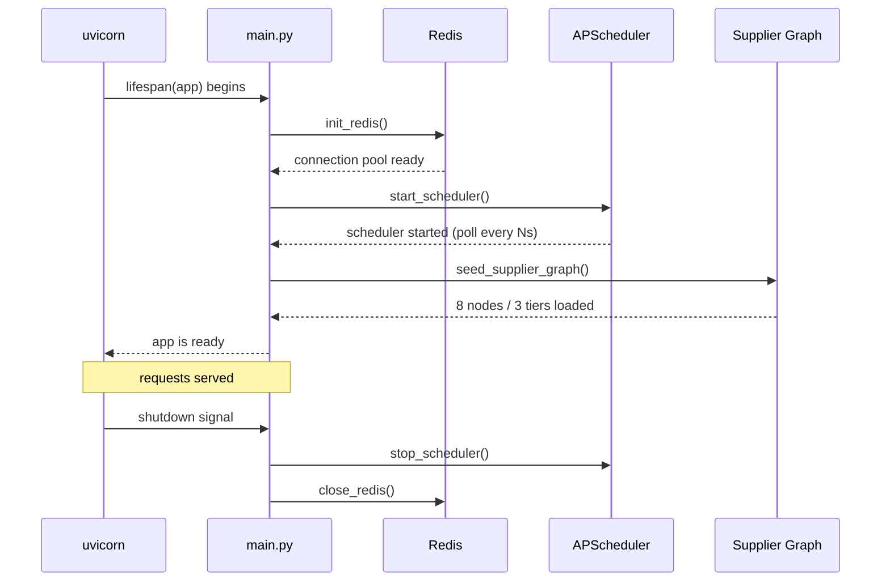
```mermaid
sequenceDiagram
    participant U as uvicorn
    participant M as main.py
    participant R as Redis
    participant S as APScheduler
    participant G as Supplier Graph

    U->>M: lifespan(app) begins
    M->>R: init_redis()
    R-->>M: connection pool ready
    M->>S: start_scheduler()
    S-->>M: scheduler started (poll every Ns)
    M->>G: seed_supplier_graph()
    G-->>M: 8 nodes / 3 tiers loaded
    M-->>U: app is ready
    Note over U,M: requests served
    U->>M: shutdown signal
    M->>S: stop_scheduler()
    M->>R: close_redis()
```

### 3.2 The Request Flow (high level)

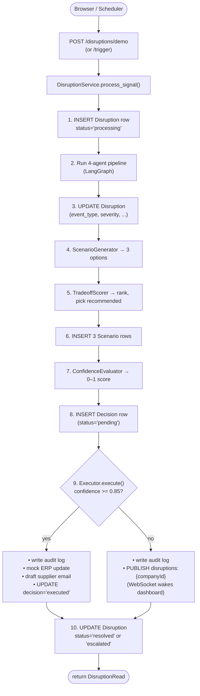
```mermaid
flowchart TB
    Start(["Browser / Scheduler"]) --> Post
    Post["POST /disruptions/demo<br/>(or /trigger)"] --> Svc
    Svc["DisruptionService.process_signal()"] --> S1
    S1["1. INSERT Disruption row<br/>status='processing'"] --> S2
    S2["2. Run 4-agent pipeline<br/>(LangGraph)"] --> S3
    S3["3. UPDATE Disruption<br/>(event_type, severity, ...)"] --> S4
    S4["4. ScenarioGenerator → 3 options"] --> S5
    S5["5. TradeoffScorer → rank, pick recommended"] --> S6
    S6["6. INSERT 3 Scenario rows"] --> S7
    S7["7. ConfidenceEvaluator → 0–1 score"] --> S8
    S8["8. INSERT Decision row<br/>(status='pending')"] --> S9
    S9{"9. Executor.execute()<br/>confidence >= 0.85?"}
    S9 -- "yes" --> Auto
    S9 -- "no" --> Esc
    Auto["• write audit log<br/>• mock ERP update<br/>• draft supplier email<br/>• UPDATE decision='executed'"] --> S10
    Esc["• write audit log<br/>• PUBLISH disruptions:{companyId}<br/>(WebSocket wakes dashboard)"] --> S10
    S10["10. UPDATE Disruption<br/>status='resolved' or 'escalated'"] --> End(["return DisruptionRead"])
```

### 3.3 Backend File Map

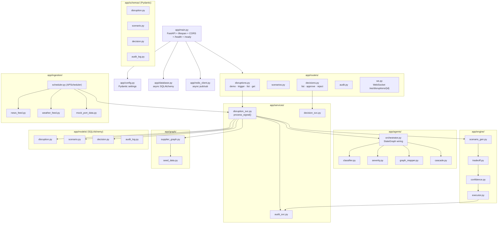
```mermaid
graph TB
    Main["app/main.py<br/>FastAPI + lifespan + CORS + /health + /ready"]
    Main --> Routers
    Main --> Config["app/config.py<br/>Pydantic settings"]
    Main --> DB["app/database.py<br/>async SQLAlchemy"]
    Main --> Redis["app/redis_client.py<br/>async pub/sub"]

    subgraph Routers["app/routers/"]
        R1["disruptions.py<br/>demo · trigger · list · get"]
        R2["scenarios.py"]
        R3["decisions.py<br/>list · approve · reject"]
        R4["audit.py"]
        R5["ws.py<br/>WebSocket /ws/disruptions/{id}"]
    end

    subgraph Services["app/services/"]
        S1["disruption_svc.py<br/>process_signal()"]
        S2["decision_svc.py"]
        S3["audit_svc.py"]
    end

    subgraph Agents["app/agents/"]
        A0["orchestrator.py<br/>StateGraph wiring"]
        A1["classifier.py"]
        A2["severity.py"]
        A3["graph_mapper.py"]
        A4["cascade.py"]
    end

    subgraph Engine["app/engine/"]
        E1["scenario_gen.py"]
        E2["tradeoff.py"]
        E3["confidence.py"]
        E4["executor.py"]
    end

    subgraph Graph["app/graph/"]
        G1["supplier_graph.py"]
        G2["seed_data.py"]
    end

    subgraph Ingest["app/ingestion/"]
        I1["scheduler.py (APScheduler)"]
        I2["news_feed.py"]
        I3["weather_feed.py"]
        I4["mock_port_data.py"]
    end

    subgraph ORM["app/models/ (SQLAlchemy)"]
        M1["disruption.py"]
        M2["scenario.py"]
        M3["decision.py"]
        M4["audit_log.py"]
    end

    subgraph Schemas["app/schemas/ (Pydantic)"]
        P1["disruption.py"]
        P2["scenario.py"]
        P3["decision.py"]
        P4["audit_log.py"]
    end

    R1 --> S1
    R3 --> S2
    S1 --> S3
    S1 --> A0
    S1 --> E1 --> E2 --> E3 --> E4
    A0 --> A1 & A2 & A3 & A4
    S1 --> M1 & M2 & M3
    E4 --> S3
    S1 --> G1
    G1 --> G2
    I1 --> S1
    I1 --> I2 & I3 & I4
```

### 3.4 WebSocket Workflow (real-time push to browser)

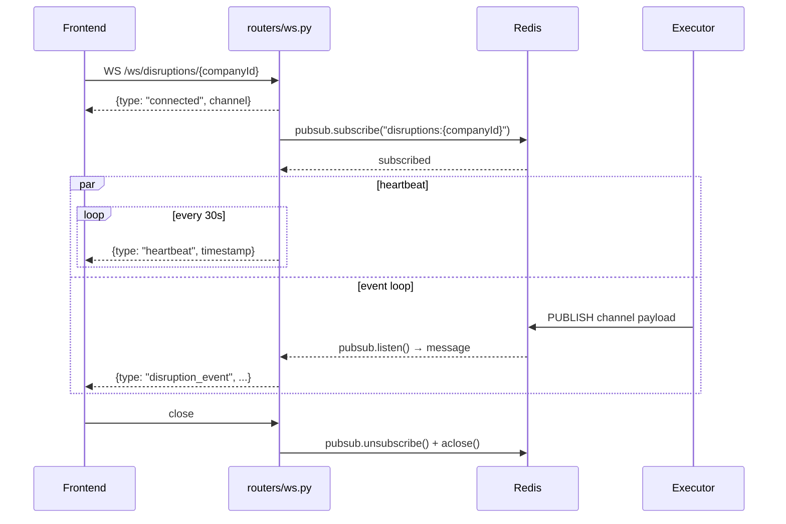
```mermaid
sequenceDiagram
    participant F as Frontend
    participant W as routers/ws.py
    participant R as Redis
    participant E as Executor

    F->>W: WS /ws/disruptions/{companyId}
    W-->>F: {type: "connected", channel}
    W->>R: pubsub.subscribe("disruptions:{companyId}")
    R-->>W: subscribed
    par heartbeat
        loop every 30s
            W-->>F: {type: "heartbeat", timestamp}
        end
    and event loop
        E->>R: PUBLISH channel payload
        R-->>W: pubsub.listen() → message
        W-->>F: {type: "disruption_event", ...}
    end
    F->>W: close
    W->>R: pubsub.unsubscribe() + aclose()
```

### 3.5 Token Request & Path (Mermaid State Diagram v2)

This is the state machine that an incoming **request token / session** moves through, including how the ML/AI pipeline branches.

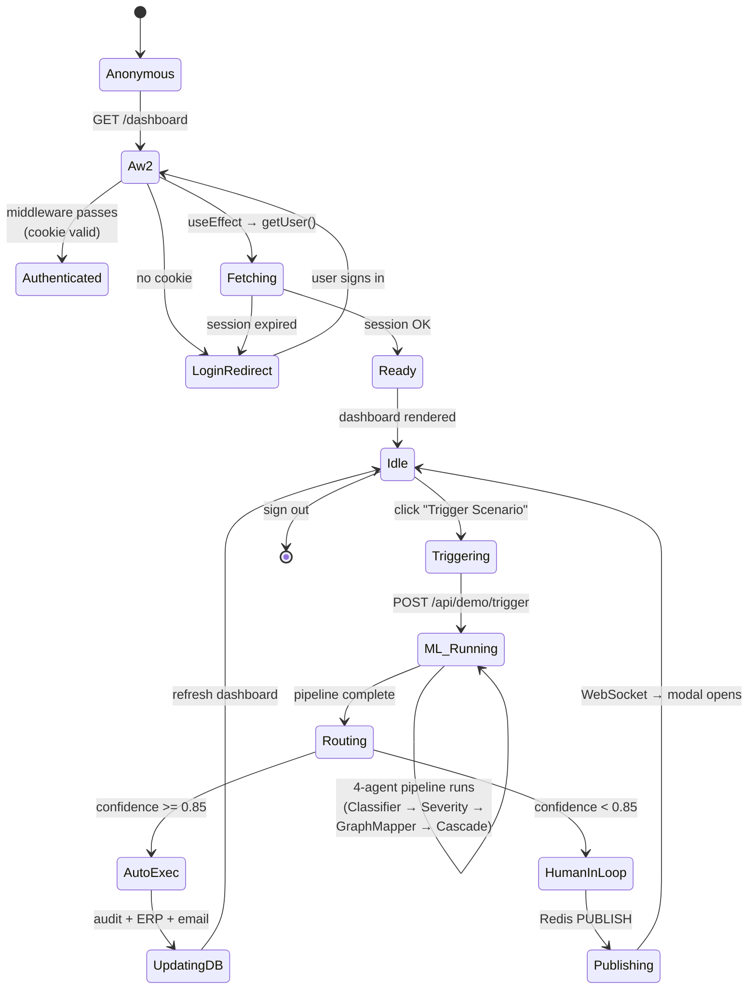
```mermaid
stateDiagram-v2
    [*] --> Anonymous
    Anonymous --> Aw2: GET /dashboard
    Aw2 --> Authenticated: middleware passes<br/>(cookie valid)
    Aw2 --> LoginRedirect: no cookie
    LoginRedirect --> Aw2: user signs in
    Aw2 --> Fetching: useEffect → getUser()
    Fetching --> Ready: session OK
    Fetching --> LoginRedirect: session expired
    Ready --> Idle: dashboard rendered
    Idle --> Triggering: click "Trigger Scenario"
    Triggering --> ML_Running: POST /api/demo/trigger
    ML_Running --> ML_Running: 4-agent pipeline runs<br/>(Classifier → Severity →<br/>GraphMapper → Cascade)
    ML_Running --> Routing: pipeline complete
    Routing --> AutoExec: confidence >= 0.85
    Routing --> HumanInLoop: confidence < 0.85
    AutoExec --> UpdatingDB: audit + ERP + email
    UpdatingDB --> Idle: refresh dashboard
    HumanInLoop --> Publishing: Redis PUBLISH
    Publishing --> Idle: WebSocket → modal opens
    Idle --> [*]: sign out
```

### 3.6 Backend ER (Code Modules)

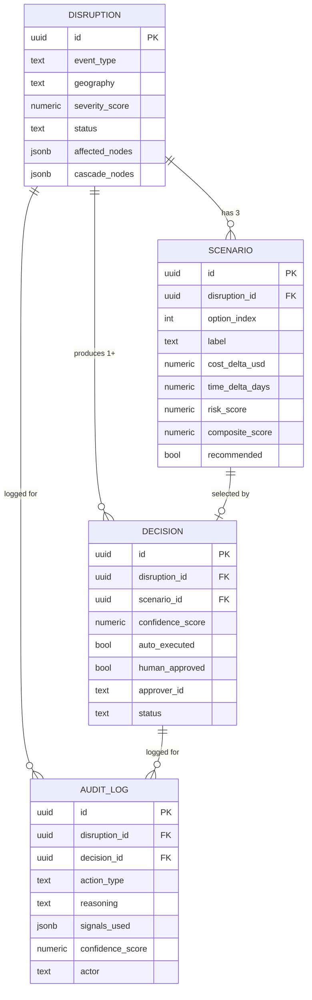
```mermaid
erDiagram
    DISRUPTION ||--o{ SCENARIO : "has 3"
    DISRUPTION ||--o{ DECISION : "produces 1+"
    DISRUPTION ||--o{ AUDIT_LOG : "logged for"
    SCENARIO ||--o| DECISION : "selected by"
    DECISION ||--o{ AUDIT_LOG : "logged for"

    DISRUPTION {
        uuid id PK
        text event_type
        text geography
        numeric severity_score
        text status
        jsonb affected_nodes
        jsonb cascade_nodes
    }
    SCENARIO {
        uuid id PK
        uuid disruption_id FK
        int option_index
        text label
        numeric cost_delta_usd
        numeric time_delta_days
        numeric risk_score
        numeric composite_score
        bool recommended
    }
    DECISION {
        uuid id PK
        uuid disruption_id FK
        uuid scenario_id FK
        numeric confidence_score
        bool auto_executed
        bool human_approved
        text approver_id
        text status
    }
    AUDIT_LOG {
        uuid id PK
        uuid disruption_id FK
        uuid decision_id FK
        text action_type
        text reasoning
        jsonb signals_used
        numeric confidence_score
        text actor
    }
```

---

## 4. AI Pipeline Architecture (the "thinking" part)

This is the heart of R3FLEX. The pipeline is built with **LangGraph** — a framework where each step is a "node" that reads the shared state and writes its own output. The nodes run in order; later nodes can read earlier nodes' outputs.

### 4.1 The 4 Agents — Workflow (Mermaid)

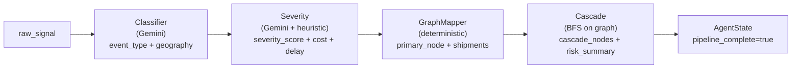
```mermaid
flowchart LR
    Sig["raw_signal"] --> Cls
    Cls["Classifier<br/>(Gemini)<br/>event_type + geography"] --> Sev
    Sev["Severity<br/>(Gemini + heuristic)<br/>severity_score + cost + delay"] --> Map
    Map["GraphMapper<br/>(deterministic)<br/>primary_node + shipments"] --> Cas
    Cas["Cascade<br/>(BFS on graph)<br/>cascade_nodes + risk_summary"] --> Done["AgentState<br/>pipeline_complete=true"]
```

### 4.2 The ML-Specific Architecture (dedicated)

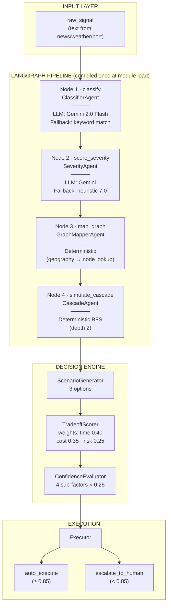
```mermaid
graph TB
    subgraph In["INPUT LAYER"]
        Sig["raw_signal<br/>(text from news/weather/port)"]
    end

    subgraph Pipeline["LANGGRAPH PIPELINE (compiled once at module load)"]
        direction TB
        N1["Node 1 · classify<br/>ClassifierAgent<br/>─────<br/>LLM: Gemini 2.0 Flash<br/>Fallback: keyword match"]
        N2["Node 2 · score_severity<br/>SeverityAgent<br/>─────<br/>LLM: Gemini<br/>Fallback: heuristic 7.0"]
        N3["Node 3 · map_graph<br/>GraphMapperAgent<br/>─────<br/>Deterministic<br/>(geography → node lookup)"]
        N4["Node 4 · simulate_cascade<br/>CascadeAgent<br/>─────<br/>Deterministic BFS<br/>(depth 2)"]
        N1 --> N2 --> N3 --> N4
    end

    subgraph Dec["DECISION ENGINE"]
        SG["ScenarioGenerator<br/>3 options"]
        TS["TradeoffScorer<br/>weights: time 0.40<br/>cost 0.35 · risk 0.25"]
        CE["ConfidenceEvaluator<br/>4 sub-factors × 0.25"]
        SG --> TS --> CE
    end

    subgraph Out["EXECUTION"]
        EX["Executor"]
        Auto["auto_execute<br/>(≥ 0.85)"]
        Esc["escalate_to_human<br/>(< 0.85)"]
        EX --> Auto
        EX --> Esc
    end

    Sig --> N1
    N4 --> SG
    CE --> EX
```

### 4.3 ML Sequence — Signal to Decision (Mermaid Sequence)

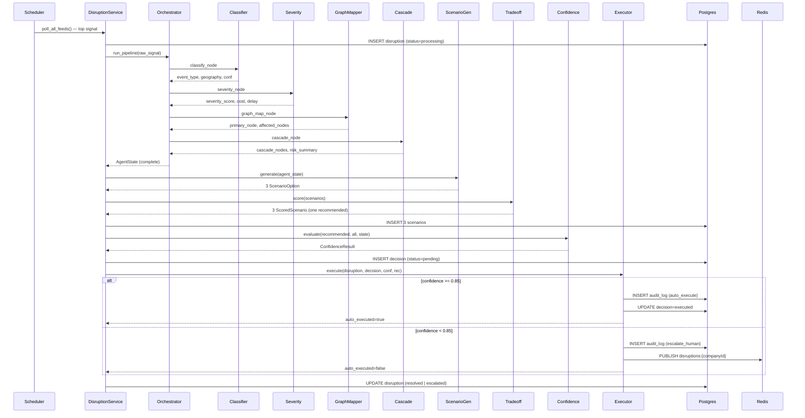
```mermaid
sequenceDiagram
    participant S as Scheduler
    participant DS as DisruptionService
    participant O as Orchestrator
    participant Cl as Classifier
    participant Sv as Severity
    participant GM as GraphMapper
    participant Cs as Cascade
    participant SG as ScenarioGen
    participant TS as Tradeoff
    participant CE as Confidence
    participant Ex as Executor
    participant DB as Postgres
    participant R as Redis

    S->>DS: poll_all_feeds() — top signal
    DS->>DB: INSERT disruption (status=processing)
    DS->>O: run_pipeline(raw_signal)
    O->>Cl: classify_node
    Cl-->>O: event_type, geography, conf
    O->>Sv: severity_node
    Sv-->>O: severity_score, cost, delay
    O->>GM: graph_map_node
    GM-->>O: primary_node, affected_nodes
    O->>Cs: cascade_node
    Cs-->>O: cascade_nodes, risk_summary
    O-->>DS: AgentState (complete)
    DS->>SG: generate(agent_state)
    SG-->>DS: 3 ScenarioOption
    DS->>TS: score(scenarios)
    TS-->>DS: 3 ScoredScenario (one recommended)
    DS->>DB: INSERT 3 scenarios
    DS->>CE: evaluate(recommended, all, state)
    CE-->>DS: ConfidenceResult
    DS->>DB: INSERT decision (status=pending)
    DS->>Ex: execute(disruption, decision, conf, rec)
    alt confidence >= 0.85
        Ex->>DB: INSERT audit_log (auto_execute)
        Ex->>DB: UPDATE decision=executed
        Ex-->>DS: auto_executed=true
    else confidence < 0.85
        Ex->>DB: INSERT audit_log (escalate_human)
        Ex->>R: PUBLISH disruptions:{companyId}
        Ex-->>DS: auto_executed=false
    end
    DS->>DB: UPDATE disruption (resolved | escalated)
```

### 4.4 ML State Diagram — Confidence Routing

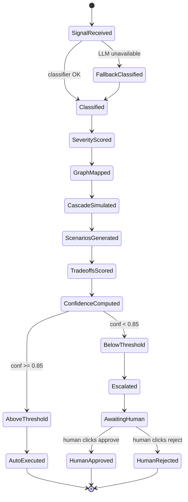
```mermaid
stateDiagram-v2
    [*] --> SignalReceived
    SignalReceived --> Classified: classifier OK
    SignalReceived --> FallbackClassified: LLM unavailable
    FallbackClassified --> Classified
    Classified --> SeverityScored
    SeverityScored --> GraphMapped
    GraphMapped --> CascadeSimulated
    CascadeSimulated --> ScenariosGenerated
    ScenariosGenerated --> TradeoffsScored
    TradeoffsScored --> ConfidenceComputed
    ConfidenceComputed --> AboveThreshold: conf >= 0.85
    ConfidenceComputed --> BelowThreshold: conf < 0.85
    AboveThreshold --> AutoExecuted
    AutoExecuted --> [*]
    BelowThreshold --> Escalated
    Escalated --> AwaitingHuman
    AwaitingHuman --> HumanApproved: human clicks approve
    AwaitingHuman --> HumanRejected: human clicks reject
    HumanApproved --> [*]
    HumanRejected --> [*]
```

### 4.5 ML Journey — Confidence Factors (Mermaid Journey)

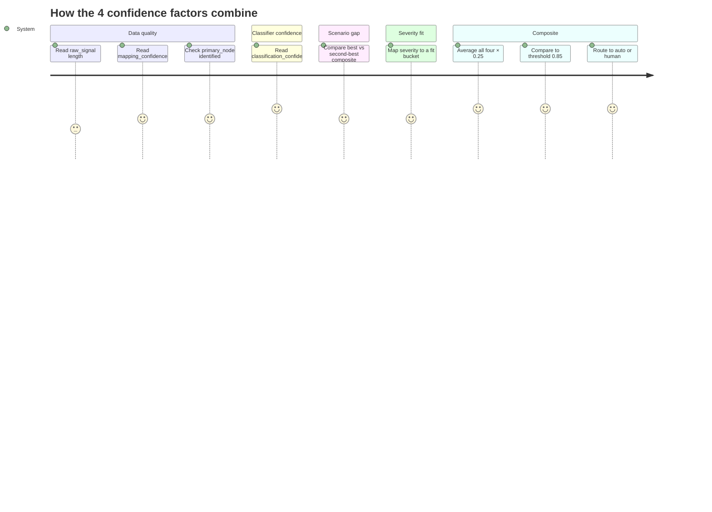
```mermaid
journey
    title How the 4 confidence factors combine
    section Data quality
      Read raw_signal length: 3: System
      Read mapping_confidence: 4: System
      Check primary_node identified: 4: System
    section Classifier confidence
      Read classification_confidence: 5: System
    section Scenario gap
      Compare best vs second-best composite: 4: System
    section Severity fit
      Map severity to a fit bucket: 4: System
    section Composite
      Average all four × 0.25: 5: System
      Compare to threshold 0.85: 5: System
      Route to auto or human: 5: System
```

### 4.6 The 4 Confidence Factors — Math Diagram

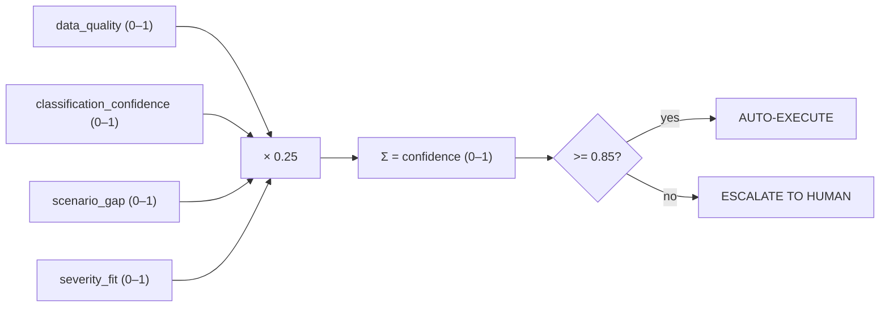
```mermaid
graph LR
    A["data_quality (0–1)"] --> M["× 0.25"]
    B["classification_confidence (0–1)"] --> M
    C["scenario_gap (0–1)"] --> M
    D["severity_fit (0–1)"] --> M
    M --> Sum["Σ = confidence (0–1)"]
    Sum --> T{>= 0.85?}
    T -- yes --> Auto["AUTO-EXECUTE"]
    T -- no --> Human["ESCALATE TO HUMAN"]
```

### 4.7 Why LangGraph?

A normal Python function would call agents one by one. **LangGraph** is useful because:
- Each node is independent — easy to test, easy to swap
- State is shared and typed (`TypedDict`)
- If any node errors, the next nodes can short-circuit
- The graph is **compiled once at module load** (not per request), so the cost is paid one time

### 4.8 LLM vs Fallback

Every AI agent has a **deterministic fallback** so the demo never breaks:

| Agent | LLM path | Fallback path |
|---|---|---|
| Classifier | Gemini → event_type, geography | Keyword match: `suez` → `trade_route_disruption`, `storm` → `extreme_weather`, etc. |
| Severity | Gemini → severity_score | Heuristic: 7.0 default, 9.0 if "suez" mentioned |
| Scenario Gen | Gemini → 3 options | Generic templates: wait / backup / air-freight |
| Graph Mapper | (deterministic) | Geography → node lookup table |
| Cascade | (deterministic BFS) | Empty cascade if graph not seeded |

If `GOOGLE_API_KEY` is not set, the LLM is skipped entirely and the fallback runs.

---

## 5. Route Monitoring — Token & Request Path

This section zooms in on **how a request is authenticated, routed, monitored, and how the ML pipeline gets a chance to act on it.**

### 5.1 Auth Token Path (Mermaid)

```mermaid
flowchart TB
    Login["User submits<br/>email + password at /login"] --> SupaAuth["Supabase Auth<br/>auth.signInWithPassword()"]
    SupaAuth --> JWT["JWT issued<br/>(access_token + refresh_token)"]
    JWT --> Cookie["Browser stores<br/>access_token in HTTP-only cookie"]
    Cookie --> Next["Subsequent /dashboard requests<br/>include cookie"]
    Next --> MW["middleware.ts → createServerClient<br/>→ supabase.auth.getUser()"]
    MW --> Verify{JWT valid?}
    Verify -- "yes" --> Allow["Allow request<br/>+ refresh response cookies"]
    Verify -- "no" --> Deny["302 → /login?next=..."]
    Allow --> Handler["Route handler<br/>(Next page or /api/*)"]
    Deny --> Login

    subgraph ML_Gate["ML pipeline access (backend)"]
        Handler --> Backend["FastAPI receives request<br/>(when /api/* proxy)"]
        Backend --> VerifyRole{"JWT has<br/>required role?"}
        VerifyRole -- "yes" --> RunML["Run DisruptionService.process_signal()"]
        VerifyRole -- "no" --> Forbidden["403 forbidden"]
    end
```

### 5.2 Real-Time Route Monitoring (Mermaid)

```mermaid
flowchart TB
    subgraph Sources["INGEST SOURCES (monitored 24/7)"]
        N["News feed poll<br/>(every N seconds)"]
        W["Weather feed poll"]
        P["Port data poll<br/>(mock + real)"]
    end

    Sources --> Sch["APScheduler → poll_all_feeds()"]
    Sch --> Top["Pick top signal by severity"]
    Top --> Proc["DisruptionService.process_signal()"]
    Proc --> Log1["INSERT disruption"]
    Log1 --> ML["Run ML pipeline"]
    ML --> Log2["INSERT scenarios + decision + audit"]
    Log2 --> Decide{Confidence?}
    Decide -- ">= 0.85" --> Act["Auto-execute<br/>(mock ERP + email)"]
    Decide -- "< 0.85" --> Push["PUBLISH to Redis<br/>channel: disruptions:{companyId}"]
    Push --> WSpush["WebSocket fan-out<br/>to all connected dashboards"]
    WSpush --> Modal["Approval modal<br/>on every connected client"]
    Modal --> Decide2{Human action}
    Decide2 -- approve --> Done1["status: approved → executed"]
    Decide2 -- reject --> Done2["status: rejected"]
```

### 5.3 Token Lifecycle (Mermaid State Diagram v2)

```mermaid
stateDiagram-v2
    [*] --> NoToken
    NoToken --> SignInFlow: visit /login
    SignInFlow --> Issued: supabase.auth.signIn
    Issued --> Active: cookie set
    Active --> Active: each request → middleware validates
    Active --> Refreshing: access_token < 60s from expiry
    Refreshing --> Active: new access_token issued
    Active --> Expired: refresh_token expired
    Expired --> NoToken: forced re-login
    Active --> Revoked: user clicks 'Sign out' or admin revoke
    Revoked --> NoToken
    NoToken --> [*]
```

### 5.4 Request-Path Walkthrough (Mermaid Journey)

```mermaid
journey
    title A request travels from browser to DB and back
    section Browser
      User clicks 'Trigger Scenario': 5: User
      Browser sends POST /api/demo/trigger: 5: System
    section Edge
      middleware.ts validates JWT: 5: Edge
      Forwards to /api route: 5: Edge
    section Next.js
      /api route uses service-role Supabase: 5: Server
      Calls backend via internal fetch or DB write: 4: Server
    section Backend
      FastAPI router receives call: 5: Server
      Runs DisruptionService.process_signal: 5: Server
      ML pipeline runs 4 agents: 4: Server
      Writes rows to Postgres: 5: Server
      Optionally publishes to Redis: 4: Server
    section Return
      201 DisruptionRead returned: 5: Server
      Browser re-fetches dashboard: 5: Client
      New card appears in Live Log: 5: User
```

---

## 6. DBMS Workflow (the Filing Cabinet)

R3FLEX uses **Supabase** (which is Postgres under the hood) plus **Row-Level Security (RLS)** to keep data safe.

### 6.1 ER Diagram — Database Schema (Mermaid)

```mermaid
erDiagram
    AUTH_USERS ||--|| PROFILES : "1:1 (on signup)"
    AUTH_USERS ||--o{ DISRUPTIONS : "owns"
    DISRUPTIONS ||--o{ SCENARIOS : "1:N (3 each)"
    DISRUPTIONS ||--o{ DECISIONS : "1:N"
    SCENARIOS ||--o{ DECISIONS : "1:N (selected by)"
    DISRUPTIONS ||--o{ AUDIT_LOGS : "1:N"
    DECISIONS ||--o{ AUDIT_LOGS : "1:N"

    AUTH_USERS {
        uuid id PK
        text email
        jsonb app_metadata
    }
    PROFILES {
        uuid id PK
        text first_name
        text last_name
        text phone
        text country
        text state
        text email
        timestamptz created_at
    }
    DISRUPTIONS {
        uuid id PK
        text event_type
        text geography
        numeric severity_score
        text raw_signal
        jsonb affected_nodes
        jsonb cascade_nodes
        text status
        timestamptz created_at
        timestamptz updated_at
    }
    SCENARIOS {
        uuid id PK
        uuid disruption_id FK
        int option_index
        text label
        text description
        numeric cost_delta_usd
        int time_delta_days
        numeric risk_score
        numeric composite_score
        boolean recommended
        timestamptz created_at
    }
    DECISIONS {
        uuid id PK
        uuid disruption_id FK
        uuid scenario_id FK
        numeric confidence_score
        boolean auto_executed
        boolean human_approved
        text approver_id
        text status
        text outcome
        timestamptz executed_at
        timestamptz created_at
    }
    AUDIT_LOGS {
        uuid id PK
        uuid disruption_id FK
        uuid decision_id FK
        text action_type
        text reasoning
        jsonb signals_used
        numeric confidence_score
        text actor
        text company_id
        timestamptz created_at
    }
```

### 6.2 Read vs Write — Who Can Do What?

The frontend **reads** with the **anon key** (limited by RLS). The backend's `/api/*` server routes **write** with the **service-role key** (bypasses RLS). This is the security model.

```mermaid
graph LR
    subgraph Browser["BROWSER (anon key)"]
        B1["SELECT disruptions<br/>SELECT scenarios<br/>SELECT decisions<br/>SELECT audit_logs"]
        B2["INSERT/UPDATE/DELETE<br/>(blocked by RLS)"]
    end

    subgraph NextAPI["NEXT.JS /api/* (service-role key, server only)"]
        N1["reads anything"]
        N2["writes anything<br/>stamps actor/approver from verified JWT"]
    end

    subgraph FastAPI["FASTAPI BACKEND (service-role key, server only)"]
        F1["reads via asyncpg"]
        F2["writes anything<br/>writes audit log FIRST, then acts"]
    end

    B1 --> Supa[("Supabase<br/>Postgres + RLS")]
    N1 --> Supa
    N2 --> Supa
    F1 --> Supa
    F2 --> Supa
```

### 6.3 Defense-in-Depth (5 security layers)

```mermaid
graph TB
    L1["Layer 1<br/>middleware.ts<br/>(Next.js)"] --> L2
    L2["Layer 2<br/>Supabase RLS<br/>(Postgres)"] --> L3
    L3["Layer 3<br/>audit_logs immutability trigger"] --> L4
    L4["Layer 4<br/>decision replay trigger"] --> L5
    L5["Layer 5<br/>CSP + security headers<br/>(next.config.mjs)"]

    L1 -.- D1["anon → /login<br/>authed → /dashboard"]
    L2 -.- D2["anon role: SELECT only<br/>service role: bypass"]
    L3 -.- D3["UPDATE/DELETE → raised exception<br/>'audit_logs are immutable'"]
    L4 -.- D4["approved/rejected → can't transition again"]
    L5 -.- D5["default-src 'self'<br/>connect-src wss: https://*.supabase.co<br/>X-Frame-Options: DENY<br/>HSTS preload"]
```

### 6.4 RLS State — How a SELECT Travels

```mermaid
sequenceDiagram
    participant B as Browser
    participant S as Supabase
    participant P as Postgres + RLS
    participant DB as Tables

    B->>S: GET /rest/v1/disruptions<br/>Authorization: Bearer <anon_jwt>
    S->>P: SELECT * FROM disruptions
    P->>P: RLS policy check<br/>USING (auth.role() = 'authenticated') OR USING (true)
    P->>DB: row scan
    DB-->>P: matching rows
    P-->>S: filtered rows
    S-->>B: 200 OK (JSON)
    Note over P: If USING (true) the filter is a no-op; JWT role still verified.
```

### 6.5 Database Schema Diagram (simplified Mermaid graph)

```mermaid
graph TB
    AU["auth.users<br/>(Supabase managed)"] -->|"1:1"| P["public.profiles"]
    AU -->|"1:N"| D["public.disruptions"]
    D -->|"1:N"| S["public.scenarios"]
    D -->|"1:N"| DC["public.decisions"]
    S -->|"1:N (selected)"| DC
    D -->|"1:N"| AL["public.audit_logs"]
    DC -->|"1:N"| AL

    D -. indexed .-> I1["disruptions_created_at_idx<br/>disruptions_status_idx"]
    S -. indexed .-> I2["scenarios_disruption_id_idx"]
    DC -. indexed .-> I3["decisions_status_idx<br/>decisions_disruption_id_idx"]
    AL -. indexed .-> I4["audit_logs_created_at_idx<br/>audit_logs_disruption_id_idx"]
```

### 6.6 SQL Migrations (version control for the database)

```mermaid
graph LR
    v1["v1: schema.sql<br/>initial tables + RLS"] --> v2
    v2["v2: 20260421_0001<br/>indexes + RLS hardening"] --> v3
    v3["v3: 20260614_0002<br/>triggers + helper functions"]
```

Migrations are forward-only. Run them in order in the Supabase SQL editor.

### 6.7 Alembic (Python-side migrations)

```mermaid
graph LR
    BE["r3flex-backend/<br/>alembic/versions/<br/>20260421_1253_...initial.py"] --> DB[("Postgres<br/>(same DB)")]
    SB["supabase/migrations/<br/>20260421_0001..."] --> DB
    SB2["supabase/migrations/<br/>20260614_0002..."] --> DB
```

The backend uses **Alembic** for SQLAlchemy ORM models. The same DB is managed by *both* Supabase SQL and Alembic. They are kept in sync (with the Supabase migration adding indexes that the Alembic one misses — see `disruptions_created_at_idx`).

---

## 7. End-to-End: From a Storm in the Suez Canal to a Decision on Screen

Let's walk through one real disruption end-to-end. The user is a pharma distributor with 4 active shipments through the Suez Canal.

```mermaid
gantt
    title Suez Canal disruption — end-to-end timeline
    dateFormat  s.S
    axisFormat  %S s
    section Ingestion
      News feed polls             :a1, 0, 1s
      DisruptionService begins    :a2, 1, 1s
    section ML Pipeline
      Classifier (Gemini)         :a3, 2, 1s
      Severity (Gemini)           :a4, 3, 1s
      GraphMapper                 :a5, 4, 1s
      Cascade (BFS)               :a6, 5, 1s
    section Decision Engine
      ScenarioGen (3 options)     :a7, 6, 1s
      TradeoffScorer              :a8, 7, 1s
      ConfidenceEvaluator         :a9, 8, 1s
    section Execution
      Audit log + ERP + email     :a10, 9, 1s
    section UI
      Dashboard refresh           :a11, 11, 2s
```

| Time | Step |
|---|---|
| T+0s | News feed reports: "Vessel diversions at Suez Canal — military activity" |
| T+1s | APScheduler fires (`poll_all_feeds`) |
| T+2s | `DisruptionService.process_signal()` begins — creates `disruption` row (status="processing") |
| T+3s | ClassifierAgent: `trade_route_disruption` / `Suez Canal, Egypt` / conf 0.94 |
| T+5s | SeverityAgent: 9.1/10 — 4 shipments affected — +$28K cost, +14 days delay |
| T+6s | GraphMapperAgent: `primary_node="suez-hub"`, 4 shipment IDs |
| T+7s | CascadeAgent: Rotterdam hub +6 days delay, Frankfurt stock-out risk |
| T+8s | ScenarioGenerator: 3 options (Cape / Air freight / Berlin backup) |
| T+9s | TradeoffScorer: Option 3 (Berlin) wins (composite 0.21) |
| T+10s | ConfidenceEvaluator: 91% (data 0.85, classifier 0.94, gap 0.88, severity 0.95) |
| T+11s | 91% ≥ 85% threshold → **AUTO-EXECUTE** path |
| T+12s | Response sent to browser (status 201) |
| T+13s | Dashboard re-fetches → Live Log shows new card "Suez Canal, Egypt • trade_route_disruption" |
| END | Total: 13 seconds from news to dashboard |

If the confidence had been *below* 85%, the executor would have published to Redis, the WebSocket would have pushed an `approval_required` event, the modal would have popped up, and a human would have approved or rejected.

---

## 8. Repository File Structure

```mermaid
graph TB
    R["R3FLEX/"] --> FE["frontend/"]
    R --> BE["r3flex-backend/"]
    R --> SB["supabase/"]
    R --> DOCS["README.md · SETUP.md · prd.md"]
    R --> ROOT["package.json (root) · .gitignore · .env.example"]

    FE --> FEAPP["app/"]
    FE --> FECOMP["components/"]
    FE --> FEHOOKS["hooks/"]
    FE --> FELIB["lib/"]
    FE --> FEPUB["public/"]
    FE --> FECFG["next.config.mjs · middleware.ts · tsconfig.json · package.json"]

    BE --> BEAPP["app/"]
    BE --> BEALEM["alembic/"]
    BE --> BETESTS["tests/"]
    BE --> BECFG["Dockerfile · docker-compose.yml · requirements.txt · pytest.ini · alembic.ini"]

    BEAPP --> BEROUTERS["routers/"]
    BEAPP --> BESERVICES["services/"]
    BEAPP --> BEAGENTS["agents/"]
    BEAPP --> BEENGINE["engine/"]
    BEAPP --> BEGRAPH["graph/"]
    BEAPP --> BEINGEST["ingestion/"]
    BEAPP --> BEMODELS["models/"]
    BEAPP --> BESCHEMAS["schemas/"]
    BEAPP --> BECORE["main.py · config.py · database.py · redis_client.py"]

    SB --> SBSCHEMA["schema.sql"]
    SB --> SBMIG["migrations/"]
    SBMIG --> SBM1["20260421_0001_initial.sql"]
    SBMIG --> SBM2["20260614_0002_security_hardening.sql"]
```

### File-by-file cheat sheet

```text
R3FLEX/
├── frontend/                            Next.js 16 app
│   ├── app/                             All pages (App Router)
│   │   ├── layout.tsx                   Root HTML, fonts, Vercel analytics
│   │   ├── page.tsx                     Landing — scroll-globe, marquee
│   │   ├── globals.css                  Global theme tokens
│   │   ├── dashboard/
│   │   │   ├── layout.tsx               Sidebar + topbar (server component)
│   │   │   └── page.tsx                 War room (client component)
│   │   ├── login/, signup/              Auth views
│   │   ├── about/, career/, contact/    Marketing
│   │   ├── customers/, pricing/         Marketing
│   │   ├── docs/, status/               Marketing
│   │   └── api/                         Next.js server routes
│   ├── components/
│   │   ├── landing/                     ScrollGlobe, ActivityTicker, …
│   │   ├── dashboard/                   ApprovalModal, Map, EventStream
│   │   ├── docs/                        ExecutionFlow, WireframeGlobe, …
│   │   └── ui/                          shadcn-style primitives
│   ├── hooks/
│   │   ├── use-disruptions-ws.ts        WebSocket client w/ Zod validation
│   │   ├── use-toast.ts                 Toast queue
│   │   └── use-mobile.ts                Responsive helper
│   ├── lib/
│   │   ├── api.ts                       Browser reads (anon key) + POST helpers
│   │   ├── api-server.ts                Server helpers (service-role key)
│   │   ├── supabase.ts                  Browser Supabase client factory
│   │   ├── errors.ts                    sanitizeError()
│   │   ├── auth-field-classes.ts        Form styling
│   │   └── utils.ts                     cn() className composer
│   ├── middleware.ts                    /dashboard auth gate
│   ├── next.config.mjs                  CSP, security headers
│   └── package.json
│
├── r3flex-backend/                      FastAPI + LangGraph
│   ├── app/
│   │   ├── main.py                      FastAPI app, lifespan, CORS
│   │   ├── config.py                    Pydantic settings (env vars)
│   │   ├── database.py                  async SQLAlchemy engine
│   │   ├── redis_client.py              async pub/sub helpers
│   │   ├── routers/
│   │   │   ├── disruptions.py           /disruptions
│   │   │   ├── scenarios.py             /scenarios
│   │   │   ├── decisions.py             /decisions
│   │   │   ├── audit.py                 /audit
│   │   │   └── ws.py                    /ws/disruptions/{id}
│   │   ├── services/
│   │   │   ├── disruption_svc.py        process_signal() orchestrator
│   │   │   ├── decision_svc.py          list/approve/reject
│   │   │   └── audit_svc.py             write audit_logs
│   │   ├── agents/
│   │   │   ├── orchestrator.py          StateGraph wiring
│   │   │   ├── classifier.py            Gemini → event_type + geography
│   │   │   ├── severity.py              Gemini → severity + cost
│   │   │   ├── graph_mapper.py          → primary_node + shipments
│   │   │   └── cascade.py               BFS over supplier graph
│   │   ├── engine/
│   │   │   ├── scenario_gen.py          produce 3 options
│   │   │   ├── tradeoff.py              weighted scoring
│   │   │   ├── confidence.py            4-factor composite
│   │   │   └── executor.py              auto-exec or escalate
│   │   ├── graph/
│   │   │   ├── supplier_graph.py        in-memory network
│   │   │   └── seed_data.py             demo: 8 nodes, 3 tiers
│   │   ├── ingestion/
│   │   │   ├── scheduler.py             APScheduler
│   │   │   ├── news_feed.py             NewsAPI
│   │   │   ├── weather_feed.py          NOAA
│   │   │   └── mock_port_data.py        hardcoded port demo
│   │   ├── models/                      SQLAlchemy ORM
│   │   │   ├── disruption.py
│   │   │   ├── scenario.py
│   │   │   ├── decision.py
│   │   │   └── audit_log.py
│   │   └── schemas/                     Pydantic request/response
│   │       ├── disruption.py
│   │       ├── scenario.py
│   │       ├── decision.py
│   │       └── audit_log.py
│   ├── alembic/
│   │   ├── env.py
│   │   └── versions/
│   │       └── 20260421_1253_initial.py
│   ├── tests/                           Pytest
│   │   ├── conftest.py
│   │   ├── test_agents.py
│   │   ├── test_engine.py
│   │   ├── test_graph.py
│   │   └── test_routes.py
│   ├── Dockerfile
│   ├── docker-compose.yml               db + redis + api
│   └── requirements.txt
│
├── supabase/                            SQL schema + migrations
│   ├── schema.sql                       v1 initial
│   └── migrations/
│       ├── 20260421_0001_initial.sql
│       └── 20260614_0002_security_hardening.sql
│
├── README.md
├── SETUP.md
├── prd.md
├── skills-lock.json
├── .gitignore
└── .settings.local.json
```

---

## 9. Quick Start (Frontend)

Requirements: Node.js 18+

```bash
cd frontend
pnpm install
pnpm dev
```

Open `http://localhost:3000`.

If you prefer npm:

```bash
cd frontend
npm install
npm run dev
```

## 10. Full Local Stack (Frontend + Backend + DB)

For full local setup including Docker services, migrations, backend API, and demo flow, see [SETUP.md](SETUP.md).

## 11. Environment Variables

Frontend variables are documented in [frontend/.env.example](frontend/.env.example):
- `NEXT_PUBLIC_SUPABASE_URL`
- `NEXT_PUBLIC_SUPABASE_ANON_KEY`
- `NEXT_PUBLIC_WS_URL` (optional override)

Backend variables are documented in [r3flex-backend/.env.example](r3flex-backend/.env.example):
- `DATABASE_URL` (asyncpg DSN)
- `REDIS_URL`
- `GOOGLE_API_KEY` (Gemini — has fallbacks if missing)
- `CONFIDENCE_THRESHOLD` (default `0.85`)
- `POLL_INTERVAL_SECONDS` (default `60`)

## 12. Development Notes

- Landing page and core brand narrative are in [frontend/app/page.tsx](frontend/app/page.tsx).
- Global theme tokens and base styles are in [frontend/app/globals.css](frontend/app/globals.css).
- Root layout and metadata are in [frontend/app/layout.tsx](frontend/app/layout.tsx).
- Backend entry point is [r3flex-backend/app/main.py](r3flex-backend/app/main.py).
- AI pipeline is wired in [r3flex-backend/app/agents/orchestrator.py](r3flex-backend/app/agents/orchestrator.py).

## 13. AI Model Architecture Pipeline (R3FLEX) — Reference Diagram

> Backend AI is implemented with **LangGraph + LangChain + Google Gemini** and a confidence-threshold human-in-the-loop execution path.

```text
External Signals / Events
        |
        v
Signal Ingestion Layer (Scheduler / API)
        |
        v
Disruption Service (FastAPI)
        |
        v
LangGraph Orchestrator (StateGraph)
        |
        v
+---------------- AI AGENT PIPELINE ----------------+
|                                                   |
|  Classifier Agent (Gemini)                        |
|        |                                          |
|        v                                          |
|  Severity Agent (LLM + Heuristic)                 |
|        |                                          |
|        v                                          |
|  Graph Mapper Agent (Supply Chain Mapping)        |
|        |                                          |
|        v                                          |
|  Cascade Agent (Impact Simulation)                |
|                                                   |
+---------------------------------------------------+
        |
        v
+--------------- DECISION ENGINE --------------------+
|                                                   |
|  Scenario Generator (Generate 3 Options)           |
|        |                                          |
|        v                                          |
|  Tradeoff Scorer (Cost / Time / Risk)             |
|        |                                          |
|        v                                          |
|  Confidence Evaluator                             |
|                                                   |
+---------------------------------------------------+
        |
        v
+---------------- EXECUTION -------------------------+
|                                                   |
|  if confidence >= threshold                       |
|        --> Auto Executor                          |
|                                                   |
|  if confidence < threshold                        |
|        --> Human-in-the-loop                      |
|                                                   |
+---------------------------------------------------+
        |
        v
+--------------------+        +----------------------+
|   PostgreSQL DB    |        |     Redis Pub/Sub    |
+--------------------+        +----------------------+
        |                               |
        v                               v
+--------------------+        +----------------------+
|   Audit Logger     |        |  WebSocket Server    |
+--------------------+        +----------------------+
        |                               |
        +---------------+---------------+
                        |
                        v
                Frontend UI / Storage
```

### Pipeline stages (what the "AI model" does)

1. **Signal ingestion** (scheduler polling + manual/demo triggers)
2. **ClassifierAgent (Gemini)** → event type + geography (fallback: keywords)
3. **SeverityAgent (Gemini)** → severity + cost/delay estimates (fallback: heuristic)
4. **GraphMapperAgent** → map disruption to supplier graph nodes + shipment IDs
5. **CascadeAgent** → simulate second-order impacts (cascade nodes, bottlenecks, stock-out risk)
6. **ScenarioGenerator** → generates **exactly 3** response options (demo: hardcoded Suez; otherwise Gemini)
7. **Tradeoff + Confidence** → ranks options + decides if confidence is above threshold
8. **Executor**
   - **Auto-exec** if confidence ≥ threshold
   - **Escalate to human** if confidence < threshold via **Redis → WebSocket → UI modal**
9. **Audit trail** persisted (reasoning, signals used, confidence, actor)
